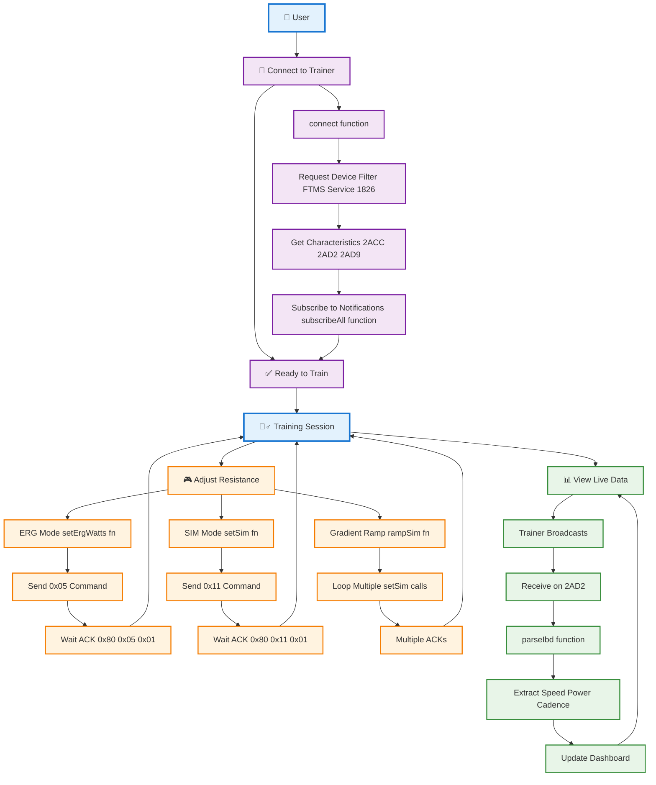

```mermaid
flowchart TD
    %% Main User Journey - Vertical Flow
    User[👤 User] --> Connect[🔗 Connect to Trainer]
    Connect --> Ready[✅ Ready to Train]
    Ready --> Train[🚴‍♂️ Training Session]
    Train --> Monitor[📊 View Live Data]
    Monitor --> D1[Trainer Broadcasts]
    
    %% Connection Details
    Connect --> C1[connect function]
    C1 --> C2[Request Device Filter FTMS Service 1826]
    C2 --> C3[Get Characteristics 2ACC 2AD2 2AD9]
    C3 --> C4[Subscribe to Notifications subscribeAll function]
    C4 --> Ready

    %% Training Controls - Horizontal Flow to the Right from Start Training
    Train --> Control[🎮 Adjust Resistance]
    Control --> ERG[ERG Mode setErgWatts fn]
    Control --> SIM[SIM Mode setSim fn]
    Control --> RAMP[Gradient Ramp rampSim fn]
    
    ERG --> E1[Send 0x05 Command]
    E1 --> ACK1[Wait ACK 0x80 0x05 0x01]
    ACK1 --> Train
    
    SIM --> S1[Send 0x11 Command]
    S1 --> ACK2[Wait ACK 0x80 0x11 0x01]
    ACK2 --> Train
    
    RAMP --> R1[Loop Multiple setSim calls]
    R1 --> ACK3[Multiple ACKs]
    ACK3 --> Train
    
    %% Live Data Flow - Continues Vertically
    D1 --> D2[Receive on 2AD2]
    D2 --> D3[parseIbd function]
    D3 --> D4[Extract Speed Power Cadence]
    D4 --> D5[Update Dashboard]
    D5 --> Monitor
    
    %% Styling for better visibility
    classDef user fill:#e3f2fd,stroke:#1976d2,stroke-width:3px
    classDef connect fill:#f3e5f5,stroke:#7b1fa2,stroke-width:2px
    classDef control fill:#fff3e0,stroke:#f57c00,stroke-width:2px
    classDef data fill:#e8f5e8,stroke:#388e3c,stroke-width:2px
    
    class User,Train user
    class Connect,C1,C2,C3,C4,Ready connect
    class Control,ERG,SIM,RAMP,E1,S1,R1,ACK1,ACK2,ACK3 control
    class Monitor,D1,D2,D3,D4,D5 data
```